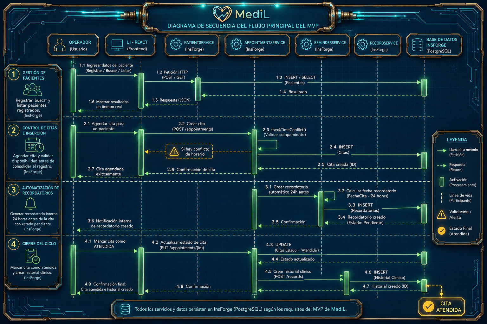

[](README.md)
[](README.es.md)

<div align="center">


<h1>MediL CRM</h1>

**Sistema de gestión de relaciones con pacientes para clínicas médicas**  
*Modular · Escalable · Adaptable a múltiples especialidades de salud*

<br/>


</div>

---

## 📖 Descripción

**MediL CRM** es una aplicación web construida como una **Línea de Producto de Software (SPL)** para el sector salud. Permite a clínicas médicas gestionar su operación completa desde una sola plataforma — y puede adaptarse a diferentes especialidades médicas sin reescribir la lógica central.

> 📚 **Contexto académico:** Ingeniería de Software II &nbsp;·&nbsp; SPL #2 — Sistemas de Gestión Empresarial

---

## ✨ Características Principales

| Módulo | Funcionalidad | Estado |
|:---|:---|:---:|
| 👤 **Pacientes** | Registro, búsqueda y gestión del perfil completo | ✅ MVP |
| 📅 **Citas** | Agendamiento con detección automática de conflictos de horario | ✅ MVP |
| 🗂️ **Historial Clínico** | Entradas cronológicas inmutables con política append-only | ✅ MVP |
| 🔔 **Recordatorios** | Notificaciones automáticas configurables (por defecto: 24h antes) | ✅ MVP |
| 📊 **Dashboard** | Resumen ejecutivo con métricas y accesos rápidos | 🔄 En progreso |

---

## 🛠️ Stack Tecnológico

<div align="center">

[](https://react.dev)
[](https://vitejs.dev)
[](https://tailwindcss.com)
[](https://reactrouter.com)

</div>

<br/>

| Capa | Tecnología | Rol en el sistema |
|:---|:---|:---|
| **Frontend** | React 18 + Vite 5 | Interfaz de usuario con componentes reutilizables y HMR |
| **Estilos** | TailwindCSS v4 | Sistema de diseño con tokens centralizados via `@theme` |
| **Enrutamiento** | React Router v6 | Navegación declarativa del lado del cliente por módulo |
| **Backend / BD** | InsForge | Persistencia integrada detrás de una interfaz de servicio uniforme |
| **Documentación** | Mermaid | Diagramas de arquitectura como código dentro del repositorio |

---

## 🏗️ Arquitectura del Sistema

<div align="center">


</div>

El sistema adopta **Arquitectura Modular por Dominio**: cada dominio es un módulo cerrado con su propio servicio y repositorio InsForge, lo que garantiza alta cohesión, bajo acoplamiento y reutilización en la SPL.

→ [Ver documentación técnica completa de arquitectura](docs/01-arquitectura.md)

---

## 📊 Flujo de Secuencia del MVP

<div align="center">



</div>

<details>
<summary>📋 Descripción de los 4 flujos principales</summary>

| # | Flujo | Descripción |
|:---:|:---|:---|
| **1** | 🧑‍⚕️ Gestión de Pacientes | Registro, búsqueda y listado en tiempo real vía InsForge |
| **2** | 📅 Control de Citas | Agendamiento con validación de conflictos antes de confirmar |
| **3** | 🔔 Recordatorios Automáticos | Generación de recordatorio 24h antes de cada cita |
| **4** | ✅ Cierre del Ciclo | Marcar cita como atendida y crear historial clínico |

</details>

---

## 📦 Instalación y Configuración

### Requisitos previos

- **Node.js** ≥ 18.x
- **npm** ≥ 9.x

### Inicio rápido

```bash
# 1. Clonar el repositorio
git clone https://github.com/juradoger/medil-crm.git
cd medil-crm

# 2. Instalar dependencias del frontend
cd frontend
npm install

# 3. Iniciar el servidor de desarrollo
npm run dev
```

> La aplicación estará disponible en **`http://localhost:5173`**

<details>
<summary>⚙️ Paleta de colores y tokens de diseño</summary>

#### Paleta de marca (`frontend/src/index.css`)

```css
@import "tailwindcss";

@theme {
  --color-primary:    #0E4A8A;   /* Azul Corporativo — títulos y botones */
  --color-accent:     #00A896;   /* Verde Aqua — elementos activos e íconos */
  --color-alert:      #FFD100;   /* Amarillo Patito — alertas y recordatorios */
  --color-background: #FFFFFF;   /* Blanco Puro — fondos y paneles */
}
```

#### Constantes configurables por especialidad (`frontend/src/core/constants.js`)

```js
// Ajustar según la especialidad del CRM:
// 48h → psicología  |  24h → medicina general  |  2h → urgencias dentales
export const HOURS_BEFORE_REMINDER = 24;

export const APPOINTMENT_STATUS = {
  SCHEDULED:  'scheduled',
  ATTENDED:   'attended',
  CANCELLED:  'cancelled',
};
```

</details>

---

## 📁 Estructura del Proyecto

```
medil-crm/
│
├── frontend/
│   └── src/
│       ├── pages/              # Dashboard · Patients · Appointments
│       │                       # Reminders · PatientDetail
│       ├── components/
│       │   └── StatusBadge.jsx # Componente de estado reutilizable (OCP)
│       ├── hooks/
│       │   ├── usePatients.js
│       │   └── useAppointments.js
│       ├── services/           # patientService · appointmentService
│       │                       # recordService · reminderService
│       └── core/
│           └── constants.js
│
├── backend/
│   ├── patients/               # PatientService + repositorio InsForge
│   ├── appointments/           # AppointmentService + repositorio InsForge
│   ├── records/                # MedicalRecordService + repositorio InsForge
│   └── reminders/              # ReminderService + repositorio InsForge
│
└── docs/
    ├── assets/                 # Imágenes y recursos visuales
    ├── 01-arquitectura.md
    ├── 02-componentes.md
    ├── 03-refactorizacion.md
    └── 04-stack.md
```

---

## 📚 Documentación Técnica

| # | Documento | Contenido |
|:---:|:---|:---|
| 01 | [🏗️ Arquitectura](docs/01-arquitectura.md) | Patrón modular por dominio · diagramas de arquitectura y flujo MVP |
| 02 | [🧩 Componentes](docs/02-componentes.md) | Catálogo de 7 componentes reutilizables con métodos y análisis SPL |
| 03 | [♻️ Refactorizaciones](docs/03-refactorizacion.md) | Técnicas R1–R2 aplicadas y R3–R5 planificadas con justificación |
| 04 | [🛠️ Stack](docs/04-stack.md) | Justificación técnica de cada tecnología con principios de IS |

---

## 👥 Contribuciones

Este es un proyecto académico cerrado. Para sugerencias o correcciones, abrir un **Issue** en este repositorio con el formato:

```
[TIPO] Título descriptivo
Tipos: [BUG] · [MEJORA] · [DOCS] · [PREGUNTA]
```

---

## 📄 Licencia

Proyecto académico — Ingeniería de Software II.  
© 2025 Ordoñez Choque Nayeli Zharit. Todos los derechos reservados.
