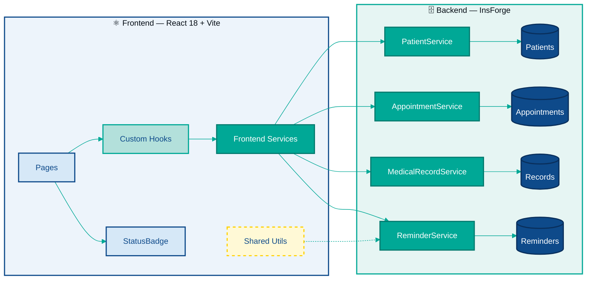
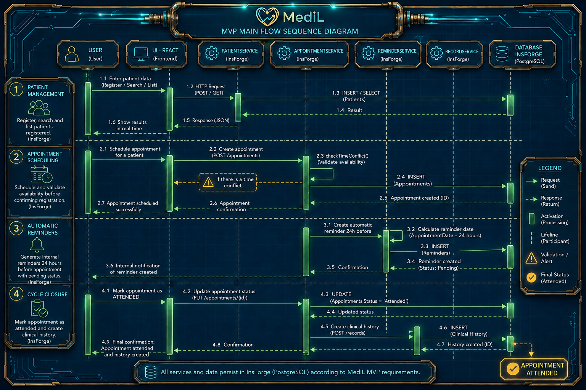
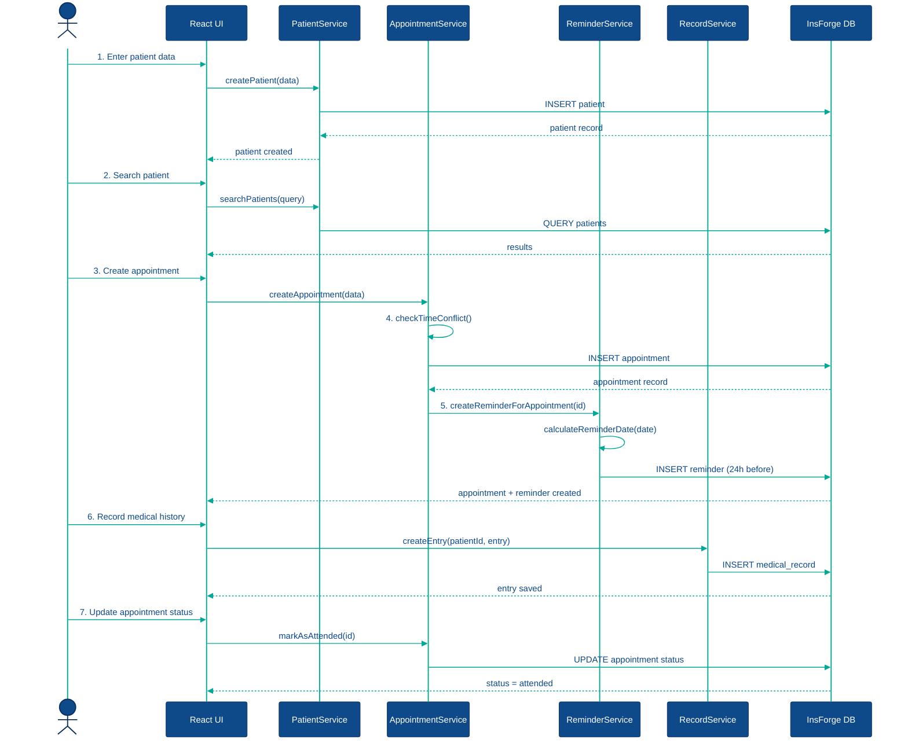

# 🏗️ System Architecture

*Domain-Driven Modular Architecture*

---

## Architectural Pattern: Domain-Driven Modular Architecture

The MediL CRM system adopts the **Domain-Driven Modular Architecture** pattern. In this pattern, code is organized around business concepts (domains) rather than horizontal technical layers.

### Justification

In a medical CRM, the natural business domains are: Patients, Appointments, Medical Records, and Reminders. Each domain has:

- **High internal cohesion:** all logic for a domain lives together (service + repository).
- **Low external coupling:** domains communicate only through defined interfaces (the services), never accessing another domain's database directly.
- **SPL reusability:** being independent modules, they can be transplanted to a CRM variant (dentistry, psychology) without dragging unwanted dependencies.

---

## Diagram 1: Complete Architecture

🔧 View technical diagram (Mermaid)

> **Pages:** Dashboard · Patients · Appointments · Reminders · PatientDetail  
> **Custom Hooks:** usePatients · useAppointments  
> **Frontend Services:** patientSvc · appointmentSvc · recordSvc · reminderSvc  
> **Shared Utils:** constants · validators · dateUtils

---

## Diagram 2: Main MVP Flow

🔧 View technical diagram (Mermaid)

---

## Reuse in the Software Product Line

The domain-driven modular architecture enables reuse in the SPL because:

| Principle | How it is applied |
|:---|:---|
| **Closed module** | Each domain has its own service and repository; replacing one does not affect the others |
| **Configurable constants** | `HOURS_BEFORE_REMINDER` adapts the system to any specialty without touching logic |
| **Generic components** | `StatusBadge` accepts any status type and extends without modifying the component (OCP) |
| **Interchangeable services** | Changing the InsForge endpoint only requires modifying `*Service.js`, not hooks or pages |

---

[🧩 Next: Components →](02-componentes.en.md) &nbsp;|&nbsp; [← Back to README](../README.md)

