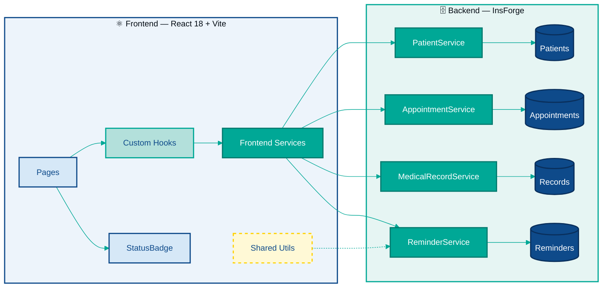
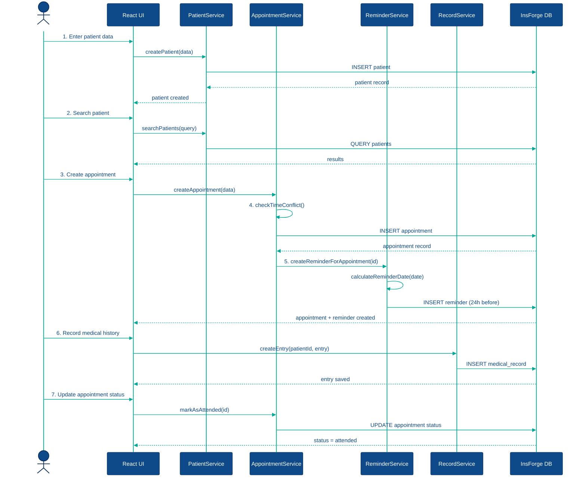

# Arquitectura del Sistema / System Architecture

🇪🇸 Español — clic para colapsar

## Patrón Arquitectónico: Arquitectura Modular por Dominio

El sistema MedIL CRM adopta el patrón de **Arquitectura Modular por Dominio** (también conocido como Domain-Driven Modular Architecture). En este patrón, el código se organiza alrededor de los conceptos del negocio (dominios) en lugar de capas técnicas horizontales.

### Justificación

En un CRM médico, los dominios naturales del negocio son: Pacientes, Citas, Historial Clínico y Recordatorios. Cada dominio tiene:

- **Alta cohesión interna:** toda la lógica de un dominio vive junta (service + repository).
- **Bajo acoplamiento externo:** los dominios se comunican únicamente a través de interfaces definidas (los servicios), nunca accediendo directamente a la base de datos del otro.
- **Reutilización en SPL:** al ser módulos independientes, pueden trasplantarse a una variante del CRM (odontología, psicología) sin arrastrar dependencias no deseadas.

---

### Diagrama 1: Arquitectura Completa

> **Pages:** Dashboard · Patients · Appointments · Reminders · PatientDetail  
> **Custom Hooks:** usePatients · useAppointments  
> **Frontend Services:** patientSvc · appointmentSvc · recordSvc · reminderSvc  
> **Shared Utils:** constants · validators · dateUtils

---

### Diagrama 2: Flujo Principal del MVP

---

### Reutilización en la Línea de Producto de Software

La arquitectura modular por dominio habilita la reutilización en la SPL porque:

1. **Cada dominio es un módulo cerrado:** tiene su propio servicio y repositorio. Reemplazar o extender un dominio no afecta a los demás.
2. **Las constantes son configurables:** cambiar `HOURS_BEFORE_REMINDER` en `constants.js` adapta el comportamiento del sistema para una especialidad distinta sin tocar lógica.
3. **Los componentes React son genéricos por diseño:** `StatusBadge` acepta cualquier tipo de estado (`appointment`, `reminder`, `patient`) y puede extenderse con nuevos tipos para nuevas especialidades.
4. **La capa de servicios frontend es intercambiable:** si una variante del CRM necesita un endpoint diferente de InsForge, solo se modifica `*Service.js`, no los hooks ni las páginas.

---

🇬🇧 English — click to expand

## Architectural Pattern: Domain-Driven Modular Architecture

The MedIL CRM system adopts the **Domain-Driven Modular Architecture** pattern. In this pattern, code is organized around business concepts (domains) rather than horizontal technical layers.

### Justification

In a medical CRM, the natural business domains are: Patients, Appointments, Medical Records, and Reminders. Each domain has:

- **High internal cohesion:** all logic for a domain lives together (service + repository).
- **Low external coupling:** domains communicate only through defined interfaces (the services), never accessing another domain's database directly.
- **SPL reusability:** being independent modules, they can be transplanted to a CRM variant (dentistry, psychology) without dragging unwanted dependencies.

---

### Diagram 1: Complete Architecture

> **Pages:** Dashboard · Patients · Appointments · Reminders · PatientDetail  
> **Custom Hooks:** usePatients · useAppointments  
> **Frontend Services:** patientSvc · appointmentSvc · recordSvc · reminderSvc  
> **Shared Utils:** constants · validators · dateUtils

---

### Diagram 2: Main MVP Flow

---

### Reuse in the Software Product Line

The domain-driven modular architecture enables reuse in the SPL because:

1. **Each domain is a closed module:** it has its own service and repository. Replacing or extending a domain does not affect the others.
2. **Constants are configurable:** changing `HOURS_BEFORE_REMINDER` in `constants.js` adapts system behavior for a different specialty without touching logic.
3. **React components are generic by design:** `StatusBadge` accepts any status type (`appointment`, `reminder`, `patient`) and can be extended with new types for new specialties.
4. **The frontend service layer is interchangeable:** if a CRM variant needs a different InsForge endpoint, only `*Service.js` is modified, not the hooks or pages.

