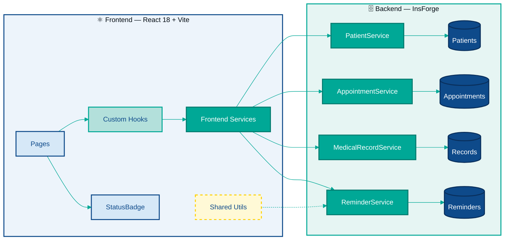
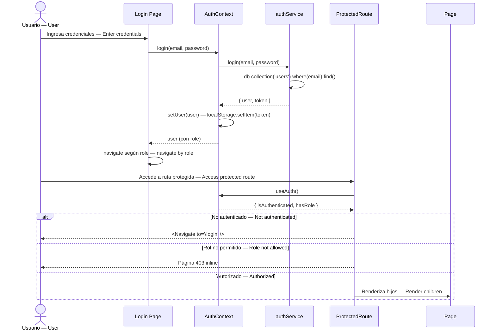
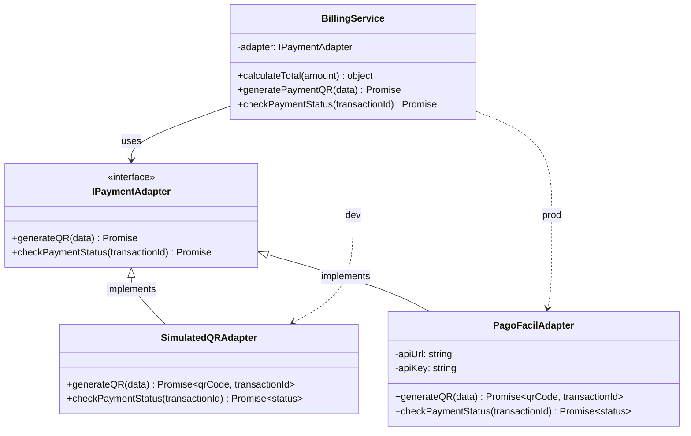

# 🏗️ Arquitectura del Sistema

*Patrón Modular por Dominio — Domain-Driven Modular Architecture*

---

## Patrón Arquitectónico: Arquitectura Modular por Dominio

El sistema MedIL CRM adopta el patrón de **Arquitectura Modular por Dominio** (Domain-Driven Modular Architecture). En este patrón, el código se organiza alrededor de los conceptos del negocio (dominios) en lugar de capas técnicas horizontales.

### Justificación

En un CRM médico, los dominios naturales del negocio son: Pacientes, Citas, Historial Clínico y Recordatorios. Cada dominio tiene:

- **Alta cohesión interna:** toda la lógica de un dominio vive junta (service + repository).
- **Bajo acoplamiento externo:** los dominios se comunican únicamente a través de interfaces definidas (los servicios), nunca accediendo directamente a la base de datos del otro.
- **Reutilización en SPL:** al ser módulos independientes, pueden trasplantarse a una variante del CRM (odontología, psicología) sin arrastrar dependencias no deseadas.

---

## Diagrama 1: Arquitectura Completa

🔧 Ver diagrama técnico (Mermaid)

> **Pages:** Dashboard · Patients · Appointments · Reminders · PatientDetail  
> **Custom Hooks:** usePatients · useAppointments  
> **Frontend Services:** patientSvc · appointmentSvc · recordSvc · reminderSvc  
> **Shared Utils:** constants · validators · dateUtils

---

## Diagrama 2: Flujo Principal del MVP

🔧 Ver diagrama técnico (Mermaid)

---

## Reutilización en la Línea de Producto de Software

La arquitectura modular por dominio habilita la reutilización en la SPL porque:

| Principio | Cómo se aplica |
|:---|:---|
| **Módulo cerrado** | Cada dominio tiene su propio servicio y repositorio; reemplazarlo no afecta a los demás |
| **Constantes configurables** | `HOURS_BEFORE_REMINDER` adapta el sistema a cualquier especialidad sin tocar lógica |
| **Componentes genéricos** | `StatusBadge` acepta cualquier estado y se extiende sin modificar el componente (OCP) |
| **Servicios intercambiables** | Cambiar el endpoint InsForge solo requiere modificar `*Service.js`, no los hooks ni páginas |

---

## Autenticación y Roles | Authentication and Roles

El sistema implementa **RBAC (Role-Based Access Control)** con tres roles: `admin`, `doctor`, `patient`. La autenticación usa `AuthContext` + `ProtectedRoute`.

The system implements **RBAC (Role-Based Access Control)** with three roles: `admin`, `doctor`, `patient`. Authentication uses `AuthContext` + `ProtectedRoute`.

🔧 Ver diagrama de autenticación (Mermaid)

### Rutas por Rol | Routes by Role

| Ruta — Route | Admin | Doctor | Patient |
|:---|:---:|:---:|:---:|
| `/` Dashboard | ✓ | ✓ | — |
| `/patients` | ✓ | ✓ | — |
| `/appointments` | ✓ | ✓ | — |
| `/reminders` | ✓ | ✓ | — |
| `/admin/branches` | ✓ | — | — |
| `/admin/billing` | ✓ | — | — |
| `/admin/supplies` | ✓ | — | — |
| `/doctor/console` | — | ✓ | — |
| `/patient/portal` | — | — | ✓ |

---

## Adapter Pattern para Pagos | Adapter Pattern for Payments

El patrón **Adapter** desacopla el código de negocio del proveedor de pagos QR concreto. Cambiar de PagoFácil a otro proveedor requiere solo un nuevo adaptador.

The **Adapter** pattern decouples business code from the concrete QR payment provider. Switching from PagoFácil to another provider requires only a new adapter.

🔧 Ver diagrama del Adapter Pattern (Mermaid)

---

[🧩 Siguiente: Componentes →](02-componentes.md) &nbsp;|&nbsp; [← Volver al README](../README.es.md)

