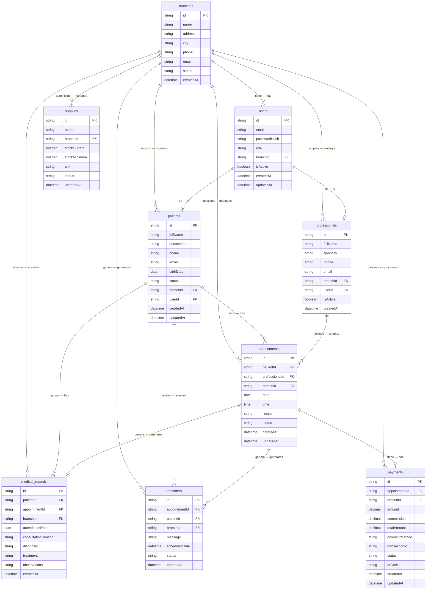

# 🗄️ Esquema de Base de Datos | Database Schema

*MedIL CRM/ERP Médico Multiclínica — Multi-clinic Medical CRM/ERP*

---

## Principio de Diseño | Design Principle

Todas las entidades incluyen `branchId` para soportar la arquitectura **multiclínica**. Una misma instalación del sistema puede gestionar múltiples sucursales de forma aislada, sin que los datos de una sucursal sean visibles desde otra.

All entities include `branchId` to support the **multi-clinic** architecture. A single installation can manage multiple branches in isolation, with no data leakage between branches.

---

## Diagrama ERD | ERD Diagram

---

## Descripción de Tablas | Table Descriptions

### 1. `branches` — Sucursales | Branches

| Campo — Field | Tipo — Type | Descripción — Description |
|:---|:---|:---|
| `id` | string PK | Identificador único — Unique identifier |
| `name` | string | Nombre de la sucursal — Branch name |
| `address` | string | Dirección física — Physical address |
| `city` | string | Ciudad — City |
| `phone` | string | Teléfono de contacto — Contact phone |
| `email` | string | Correo electrónico — Email |
| `status` | string | `active` / `inactive` |
| `createdAt` | datetime | Fecha de creación — Creation date |

**Justificación técnica | Technical justification:**
Es la entidad raíz del modelo multiclínica. Actúa como partición lógica de datos. Cada tabla hija lleva `branchId` para aislar datos por sucursal sin necesidad de múltiples bases de datos.

It is the root entity of the multi-clinic model. It acts as a logical data partition. Every child table carries `branchId` to isolate data per branch without requiring multiple databases.

---

### 2. `users` — Usuarios | Users

| Campo — Field | Tipo — Type | Descripción — Description |
|:---|:---|:---|
| `id` | string PK | Identificador único — Unique identifier |
| `email` | string | Correo de acceso — Login email |
| `passwordHash` | string | Contraseña hasheada — Hashed password |
| `role` | string | `admin` / `doctor` / `patient` |
| `branchId` | string FK | Sucursal a la que pertenece — Branch |
| `isActive` | boolean | Habilitado para ingresar — Enabled to login |
| `createdAt` | datetime | Fecha de creación — Creation date |
| `updatedAt` | datetime | Última modificación — Last modified |

**Justificación técnica | Technical justification:**
Centraliza la autenticación y el control de acceso por rol (RBAC). Separar `users` de `patients` y `professionals` permite que una persona tenga un perfil de usuario sin necesariamente ser un profesional del sistema.

Centralizes authentication and role-based access control (RBAC). Separating `users` from `patients` and `professionals` allows a person to have a user profile without necessarily being a system professional.

---

### 3. `patients` — Pacientes | Patients

| Campo — Field | Tipo — Type | Descripción — Description |
|:---|:---|:---|
| `id` | string PK | Identificador único — Unique identifier |
| `fullName` | string | Nombre completo — Full name |
| `documentId` | string | CI/DNI del paciente — Patient ID document |
| `phone` | string | Teléfono — Phone |
| `email` | string | Correo electrónico — Email |
| `birthDate` | date | Fecha de nacimiento — Birth date |
| `status` | string | `active` / `inactive` |
| `branchId` | string FK | Sucursal — Branch |
| `userId` | string FK | Enlace opcional al usuario del sistema — Optional link to system user |
| `createdAt` | datetime | Fecha de registro — Registration date |
| `updatedAt` | datetime | Última modificación — Last modified |

**Justificación técnica | Technical justification:**
`userId` es nullable porque no todos los pacientes acceden al portal del paciente. La separación entre entidad de paciente y usuario permite registrar pacientes manualmente sin requerirles credenciales de acceso.

`userId` is nullable because not all patients access the patient portal. Separating the patient entity from the user allows registering patients manually without requiring login credentials.

---

### 4. `professionals` — Profesionales | Professionals

| Campo — Field | Tipo — Type | Descripción — Description |
|:---|:---|:---|
| `id` | string PK | Identificador único — Unique identifier |
| `fullName` | string | Nombre completo — Full name |
| `specialty` | string | Especialidad médica — Medical specialty |
| `phone` | string | Teléfono — Phone |
| `email` | string | Correo electrónico — Email |
| `branchId` | string FK | Sucursal donde trabaja — Branch |
| `userId` | string FK | Enlace al usuario del sistema — System user link |
| `isActive` | boolean | Activo en el sistema — Active in system |
| `createdAt` | datetime | Fecha de registro — Registration date |

**Justificación técnica | Technical justification:**
Modela a los médicos/profesionales de salud que atienden citas. El campo `specialty` permite que en la SPL se filtren profesionales por área (odontología, fisioterapia, etc.) sin cambiar el esquema.

Models the doctors/health professionals who attend appointments. The `specialty` field allows the SPL to filter professionals by area (dentistry, physiotherapy, etc.) without changing the schema.

---

### 5. `appointments` — Citas | Appointments

| Campo — Field | Tipo — Type | Descripción — Description |
|:---|:---|:---|
| `id` | string PK | Identificador único — Unique identifier |
| `patientId` | string FK | Paciente — Patient |
| `professionalId` | string FK | Profesional que atiende — Professional |
| `branchId` | string FK | Sucursal — Branch |
| `date` | date | Fecha de la cita — Appointment date |
| `time` | time | Hora de la cita — Appointment time |
| `reason` | string | Motivo de consulta — Consultation reason |
| `status` | string | `scheduled` / `cancelled` / `attended` / `pending_payment` |
| `createdAt` | datetime | Fecha de creación — Creation date |
| `updatedAt` | datetime | Última modificación — Last modified |

**Justificación técnica | Technical justification:**
El estado `pending_payment` permite bloquear la liberación de la cita hasta que el pago QR sea confirmado. Este ciclo de vida de cuatro estados cubre todos los escenarios del flujo médico.

The `pending_payment` status allows blocking the appointment release until the QR payment is confirmed. This four-state lifecycle covers all scenarios in the medical flow.

---

### 6. `medical_records` — Historial Clínico | Medical Records

| Campo — Field | Tipo — Type | Descripción — Description |
|:---|:---|:---|
| `id` | string PK | Identificador único — Unique identifier |
| `patientId` | string FK | Paciente — Patient |
| `appointmentId` | string FK (nullable) | Cita origen (opcional) — Source appointment (optional) |
| `branchId` | string FK | Sucursal — Branch |
| `attendanceDate` | date | Fecha de atención — Attendance date |
| `consultationReason` | string | Motivo de consulta — Consultation reason |
| `diagnosis` | string | Diagnóstico — Diagnosis |
| `treatment` | string | Tratamiento — Treatment |
| `observations` | string | Observaciones adicionales — Additional observations |
| `createdAt` | datetime | Fecha de creación — Creation date |

**Justificación técnica | Technical justification:**
Política **append-only**: las entradas se crean pero nunca se editan ni eliminan (sin `updatedAt`). `appointmentId` es nullable para permitir entradas manuales sin cita previa. Esto garantiza integridad del historial clínico.

**Append-only** policy: entries are created but never edited or deleted (no `updatedAt`). `appointmentId` is nullable to allow manual entries without a prior appointment. This guarantees medical record integrity.

---

### 7. `reminders` — Recordatorios | Reminders

| Campo — Field | Tipo — Type | Descripción — Description |
|:---|:---|:---|
| `id` | string PK | Identificador único — Unique identifier |
| `appointmentId` | string FK | Cita vinculada — Linked appointment |
| `patientId` | string FK | Paciente destinatario — Target patient |
| `branchId` | string FK | Sucursal — Branch |
| `message` | string | Mensaje del recordatorio — Reminder message |
| `scheduledDate` | datetime | Cuándo enviar — When to send |
| `status` | string | `pending` / `sent` |
| `createdAt` | datetime | Fecha de creación — Creation date |

**Justificación técnica | Technical justification:**
`scheduledDate` se calcula automáticamente como `fecha_cita − HOURS_BEFORE_REMINDER`. Separar recordatorios en su propia tabla permite procesar envíos masivos de forma asíncrona y reintentar envíos fallidos sin afectar las citas.

`scheduledDate` is automatically calculated as `appointment_date − HOURS_BEFORE_REMINDER`. Separating reminders into their own table allows processing bulk sends asynchronously and retrying failed sends without affecting appointments.

---

### 8. `payments` — Pagos | Payments

| Campo — Field | Tipo — Type | Descripción — Description |
|:---|:---|:---|
| `id` | string PK | Identificador único — Unique identifier |
| `appointmentId` | string FK | Cita asociada — Associated appointment |
| `branchId` | string FK | Sucursal — Branch |
| `amount` | decimal | Monto base en Bs — Base amount in Bs |
| `commission` | decimal | Comisión QR (2%) — QR commission (2%) |
| `totalAmount` | decimal | Total cobrado — Total charged |
| `paymentMethod` | string | `qr` / `cash` |
| `transactionId` | string | ID de transacción del proveedor — Provider transaction ID |
| `status` | string | `pending` / `approved` / `rejected` |
| `qrCode` | string | Código QR en base64 — QR code in base64 |
| `createdAt` | datetime | Fecha de creación — Creation date |
| `updatedAt` | datetime | Última modificación — Last modified |

**Justificación técnica | Technical justification:**
Almacena `commission` y `totalAmount` de forma explícita para auditoría. El Adapter Pattern en `BillingService` permite cambiar el proveedor (PagoFácil → otro) sin alterar esta tabla ni la lógica de la cita.

Stores `commission` and `totalAmount` explicitly for auditing. The Adapter Pattern in `BillingService` allows changing the provider (PagoFácil → other) without altering this table or appointment logic.

---

### 9. `supplies` — Insumos | Supplies

| Campo — Field | Tipo — Type | Descripción — Description |
|:---|:---|:---|
| `id` | string PK | Identificador único — Unique identifier |
| `name` | string | Nombre del insumo — Supply name |
| `branchId` | string FK | Sucursal — Branch |
| `stockCurrent` | integer | Stock actual — Current stock |
| `stockMinimum` | integer | Stock mínimo de alerta — Alert minimum stock |
| `unit` | string | Unidad (unidades, cajas, frascos) — Unit |
| `status` | string | `ok` / `low` / `critical` |
| `updatedAt` | datetime | Última actualización — Last update |

**Justificación técnica | Technical justification:**
`status` se computa comparando `stockCurrent` vs `stockMinimum`. Sin `createdAt` porque el interés es el estado actual del stock, no el histórico de creación. En la SPL, cada especialidad puede extender las unidades sin cambiar el esquema.

`status` is computed by comparing `stockCurrent` vs `stockMinimum`. No `createdAt` because the interest is the current stock state, not creation history. In the SPL, each specialty can extend the units without changing the schema.

---

## Resumen de Relaciones | Relationship Summary

| Relación — Relationship | Tipo — Type | Descripción — Description |
|:---|:---|:---|
| `branches` → `users` | 1:N | Una sucursal tiene muchos usuarios — A branch has many users |
| `branches` → `patients` | 1:N | Una sucursal registra muchos pacientes — A branch registers many patients |
| `users` → `patients` | 1:0..1 | Un usuario puede ser paciente — A user may be a patient |
| `users` → `professionals` | 1:0..1 | Un usuario puede ser profesional — A user may be a professional |
| `patients` → `appointments` | 1:N | Un paciente tiene muchas citas — A patient has many appointments |
| `professionals` → `appointments` | 1:N | Un profesional atiende muchas citas — A professional attends many appointments |
| `appointments` → `medical_records` | 1:0..1 | Una cita genera un registro clínico — An appointment generates a medical record |
| `appointments` → `reminders` | 1:N | Una cita genera recordatorios — An appointment generates reminders |
| `appointments` → `payments` | 1:0..1 | Una cita tiene un pago — An appointment has a payment |

---

[← 🏗️ Arquitectura](01-arquitectura.md) &nbsp;|&nbsp; [← Volver al README](../README.es.md)

